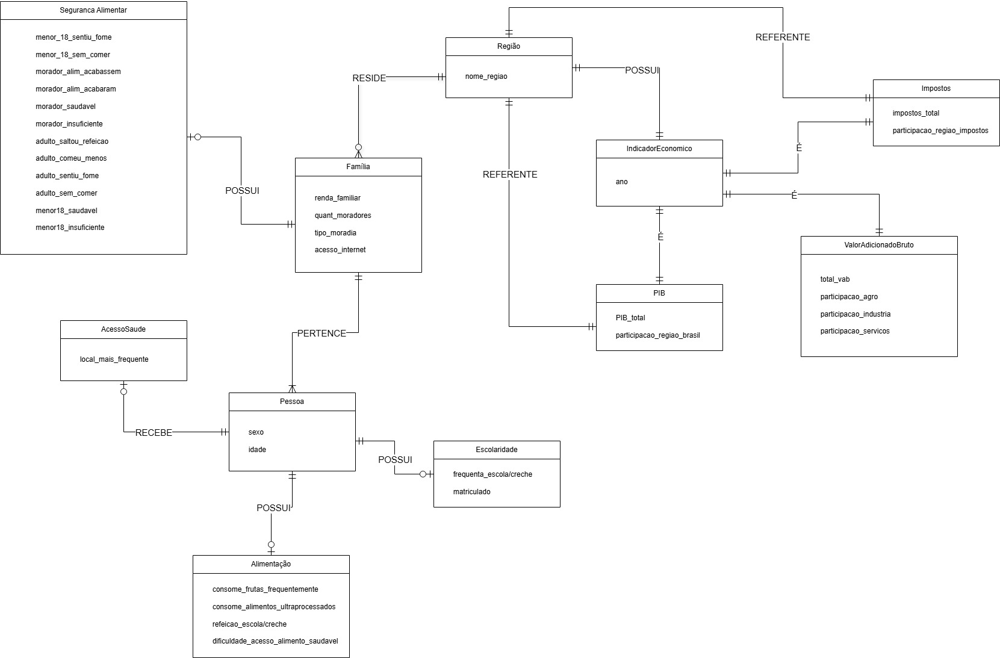
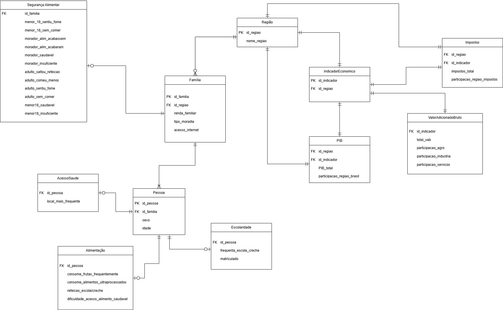

# 🌎MC 536 - Projeto 1 de Banco de Dados:

ID do grupo: 13.

Frederico Jon Campos RA:243387

Vinicius Brito Santos Oliveira Carneiro RA:244354

Tema do projeto: Análise de fatores econômicos e biomarcadores em crianças e famílias brasileiras para avaliação do bem-estar e risco nutricional.
Objetivo de Desenvolvimento Sustentável: 3 – Saúde e Bem-Estar

Este projeto tem como objetivo modelar, popular e consultar um banco de dados relacional que integra informações econômicas e sociais das regiões brasileiras, com foco em indicadores como participação setorial (agro, indústria, serviços), insegurança alimentar infantil e dificuldades de acesso a serviços.


---

### Escolha dos datasets

Os seguintes datasets foram escolhidos (arquivos na pasta `datasets`:

- https://dados.gov.br/dados/conjuntos-dados/estudo-nacional-de-alimentacao-e-nutricao-infantil-enani-2019
- https://sidra.ibge.gov.br/tabela/5938 

Davido a alguns erros nos datasets originais, eles precisaram ser tratados. Os datasets tratados encontram se na pasta `datasets_tratados`

---

## 🧱 Componentes Desenvolvidos

### 1. Modelo Conceitual


### 2. Modelo Relacional


### 3. Modelo Físico

```sql
BEGIN;

CREATE SCHEMA IF NOT EXISTS ods;
SET search_path TO ods, public;

-- Regiões do país
CREATE TABLE regiao (
    id_regiao   SERIAL PRIMARY KEY,
    nome_regiao VARCHAR(100) NOT NULL
);

-- Famílias (uma região tem muitas famílias)
CREATE TABLE familia (
    id_familia      SERIAL PRIMARY KEY,
    id_regiao       INT NOT NULL REFERENCES regiao(id_regiao),
    situacao        VARCHAR(100),
    renda_familiar  DECIMAL(10,2),
    tipo_moradia    VARCHAR(100),
    acesso_internet BOOLEAN
);

-- Pessoas (uma família tem muitas pessoas)
CREATE TABLE pessoa (
    id_pessoa  SERIAL PRIMARY KEY,
    id_familia INT NOT NULL REFERENCES familia(id_familia),
    sexo       CHAR(1)  NOT NULL CHECK (sexo IN ('M','F','O')),
    idade      INT CHECK (idade >= 0)
);


-- Acesso à saude de cada pessoa
CREATE TABLE acesso_saude (
    id_pessoa            INT PRIMARY KEY REFERENCES pessoa(id_pessoa),
    local_mais_frequente VARCHAR(100)
);

-- Acesso à educação de cada pessoa
CREATE TABLE escolaridade (
    id_pessoa                INT PRIMARY KEY REFERENCES pessoa(id_pessoa),
    frequenta_escola_creche  BOOLEAN,
    matriculado              BOOLEAN
);

-- Segurança alimentar de cada família
CREATE TABLE seguranca_alimentar (
    id_familia                 INT PRIMARY KEY REFERENCES familia(id_familia),
    menor_18_sentiu_fome                  BOOLEAN,
    menor_18_sem_comer         BOOLEAN,
    morador_alim_acabassem     BOOLEAN,
    morador_alim_acabaram      BOOLEAN,
    morador_saudavel           BOOLEAN,
    morador_insuficiente       BOOLEAN,
    adulto_saltou_refeicao     BOOLEAN,
    adulto_comeu_menos         BOOLEAN,
    adulto_sentiu_fome         BOOLEAN,
    adulto_sem_comer           BOOLEAN,
    menor18_saudavel           BOOLEAN,
    menor18_insuficiente       BOOLEAN
);


-- Alimentação de cada pessoa
CREATE TABLE alimentacao (
    id_pessoa                           INT PRIMARY KEY REFERENCES pessoa(id_pessoa),
    consome_frutas_frequentemente       BOOLEAN,
    consome_alimentos_ultraprocessados  BOOLEAN,
    refeicao_escola_creche              VARCHAR(100),
    dificuldade_acesso_alimento_saudavel BOOLEAN
);


-- Indicador econômico por região
CREATE TABLE indicador_economico (
    id_indicador SERIAL PRIMARY KEY,
    id_regiao    INT NOT NULL REFERENCES regiao(id_regiao),
);


-- Impostos (tabela SEPARADA)
CREATE TABLE impostos (
    id_regiao                   INT NOT NULL REFERENCES regiao(id_regiao),
    id_indicador                INT NOT NULL REFERENCES indicador_economico(id_indicador),
    impostos_total              DECIMAL(15,2),
    participacao_regiao_impostos DECIMAL(5,2),
    PRIMARY KEY (id_regiao, id_indicador)
);

-- Valor Adicionado Bruto por setor
CREATE TABLE valor_adicionado_bruto (
    id_indicador           INT PRIMARY KEY REFERENCES indicador_economico(id_indicador),
    total_vab              DECIMAL(15,2),
    participacao_agro      DECIMAL(5,2),
    participacao_industria DECIMAL(5,2),
    participacao_servicos  DECIMAL(5,2)
);

-- Produto Interno Bruto regional
CREATE TABLE pib (
    id_regiao                  INT NOT NULL REFERENCES regiao(id_regiao),
    id_indicador               INT NOT NULL REFERENCES indicador_economico(id_indicador),
    pib_total                  DECIMAL(15,2),
    participacao_regiao_brasil DECIMAL(5,2),
    PRIMARY KEY (id_regiao, id_indicador)
);

COMMIT;
```

### 4. População do Banco com Python
O script `populate_db.py`:
- Lê e trata os arquivos `.csv` com `pandas`
- Usa `sqlalchemy` + `psycopg2` para conexão PostgreSQL
- Carrega regiões, indicadores, famílias e pessoas com integridade referencial
- Converte campos booleanos e numéricos corretamente
- Encapsula toda a lógica de ETL (Extract-Transform-Load)

## 🧠 Geração das Consultas

As queries foram pensadas para responder as seguintes perguntas:

1.  Qual a relação entre participação no setor agro e insegurança alimentar infantil?
2.  Entre regiões cujo setor de serviços > 40 % do Valor Adicionado Bruto (VAB), onde se concentra a maior proporção de pessoas que relatam dificuldade de acesso a alimentos saudáveis?
3.  Em quais regiões a procura por “consultório particular” ou “clínica privada” é mais frequente, e como esses percentuais se relacionam com os principais indicadores econômicos regionais (participação de serviços e indústria no VAB, PIB total e total de impostos)?
4.  Como a renda familiar (em quartil) influencia o consumo de frutas e de ultraprocessados entre crianças (<18 anos)?
5.  Em que medida a participação da indústria no VAB de cada região se associa à proporção de crianças (menores de 18 anos) matriculadas em escola ou creche?

---

## 🚀 Como Executar

### Pré-requisitos

- PostgreSQL 13+
- Python 3.X
- Biblioteca `psycopg2`, `pandas`, `sqlalchemy`, `python-dotenv`

### Passos

1. Configure seu arquivo `.env`:
```env
PGHOST=localhost
PGPORT=5432
PGUSER=seu_usuario
PGPASSWORD=sua_senha
PGDATABASE=nome_do_banco
```

2. Crie o banco de dados no pgAdmin4 com os dados do passo anterior;
3. Execute uma Query no "Query Tool Workspace" do seu banco de dados no pgAdmin4 com o script em `modelo_fisico.sql`;
4. Execute o script de população `populate_db.py`;
5. Execute o código de consultas `pythonquery.py` ou rode cada query da pasta `query` no "Query Tool Workspace" do pgAdmin4;
6. Os resultados observados serão como os observados na pasta `resultados_queries`.


## 🛠️ Tecnologias Utilizadas

- PostgreSQL
- Python (`pandas`, `sqlalchemy`, `psycopg2`)
- SQL (DDL e DML)
- Git + GitHub

---
